# Git Basics (Short Version) Activities

This repository contains the reference materials for engineers who need to learn and practice the basics of version control using Git and GitHub.

The preferences are that you will use GitBash (on Windows) or Terminal (on MacOS/Linux) to complete these activities.

---

## Pre-requisites

### 1. You have downloaded and install Git on your computer

> For Windows users, you can download Git from the [Git for Windows website](https://gitforwindows.org/)  
> For MacOS users, you can install Git using Homebrew with the command `brew install git`  
> For Linux users, you can install Git using your package manager with the command `sudo apt-get install git`

### 2. You have signed up for a GitHub account

> If you haven't got a GitHub account, go to [https://github.com] and sign up for a free account  
> You will be able to enrol your account into the GitHub Education program to get access to free resources

### 3. You have configured Git with your GitHub account

> You will need to configure Git with your GitHub account so that you can push and pull changes to and from GitHub  
> You can do this by running the following commands in your terminal or GitBash:

```bash
git config --global user.name "Your Name"
git config --global user.email "your@github-account.email"
git config --global init.defaultBranch main
```

> The `init.defaultBranch` command is optional, but it is recommended to set this to `main` to match the default branch name on GitHub and is a more inclusive term than the current default of `master` which is currently being phased out

---

## Contents

- [Git Basics (Short Version) Activities](#git-basics-short-version-activities)
  - [Pre-requisites](#pre-requisites)
    - [1. You have downloaded and install Git on your computer](#1-you-have-downloaded-and-install-git-on-your-computer)
    - [2. You have signed up for a GitHub account](#2-you-have-signed-up-for-a-github-account)
    - [3. You have configured Git with your GitHub account](#3-you-have-configured-git-with-your-github-account)
  - [Contents](#contents)
  - [Activity 1: Fork an existing GitHub Repository](#activity-1-fork-an-existing-github-repository)
  - [Activity 2: Cloning a Repository](#activity-2-cloning-a-repository)
  - [Activity 3: Making and Managing Changes](#activity-3-making-and-managing-changes)
    - [Activity 3.1 - Changing an Existing File and Committing them](#activity-31---changing-an-existing-file-and-committing-them)
    - [Activity 3.2 - Adding a New File and Tracking it](#activity-32---adding-a-new-file-and-tracking-it)
    - [Activity 3.3 - Making Changes to Multiple Files and Committing them](#activity-33---making-changes-to-multiple-files-and-committing-them)
    - [Activity 3.4 - Pushing to the Remote Repository on GitHub](#activity-34---pushing-to-the-remote-repository-on-github)
  - [Activity 4: Going Back in Time](#activity-4-going-back-in-time)
    - [Activity 4.1 - Checking the Commit History](#activity-41---checking-the-commit-history)
    - [Activity 4.2 - Viewing a Previous Commit](#activity-42---viewing-a-previous-commit)
    - [Activity 4.3 - Returning to the Most Recent Commit](#activity-43---returning-to-the-most-recent-commit)
  - [Additional Activities](#additional-activities)
    - [Activity 5: Branching and Merging](#activity-5-branching-and-merging)
      - [Activity 5.1 - Creating a New Branch locally](#activity-51---creating-a-new-branch-locally)
      - [Activity 5.2 - Making Changes on the New Branch](#activity-52---making-changes-on-the-new-branch)
      - [Activity 5.3 - Pushing the New Branch to GitHub](#activity-53---pushing-the-new-branch-to-github)
      - [Activity 5.4 - Starting the Merge of the New Branch into `main` by Creating a Pull Request](#activity-54---starting-the-merge-of-the-new-branch-into-main-by-creating-a-pull-request)
      - [Activity 5.5 - Reviewing the Pull Request and Completing the Merge into `main`](#activity-55---reviewing-the-pull-request-and-completing-the-merge-into-main)
      - [Activity 5.5 - Deleting the New Branch both locally and on GitHub](#activity-55---deleting-the-new-branch-both-locally-and-on-github)

---
---

## Activity 1: Fork an existing GitHub Repository

Forking a repository is a way to create a copy of an existing repository on GitHub that you can make changes to without affecting the original repository.

**Step 1.** Open this repository from GitHub in your browser: [https://github.com/dfa-data-fundamentals/git-basics-activities]

**Step 2.** Click the "Fork" button in the top right corner of the page

<div style="border: 1px solid rgb(128, 128, 128); margin: 20px; text-align: center;">
    
</div>

**Step 3.** Select your account as the destination for the fork and then click the "Create fork" button

<div style="border: 1px solid rgb(128, 128, 128); margin: 20px; text-align: center;">
    
</div>

**Step 4.** Wait for the fork to be created and then you will be taken to your forked repository

<div style="border: 1px solid rgb(128, 128, 128); margin: 20px; text-align: center;">
    
</div>

- You are now able to make changes to this repository without affecting the original repository

> This is useful if you are using a repo as a starting point for your own project

- You can create a pull request to suggest changes to the original repository that the owner can approve or reject
- You can keep your for up-to-date with the original repository by syncing the changes from the original repository to your fork

---
---

## Activity 2: Cloning a Repository

Cloning a repository is a way to create a copy of an existing repository on GitHub on your local computer that you can make changes to and push back to GitHub.

> **Note:** This can be done for ANY repository you have access to, not just forked repos

**Step 1.** Open your forked repository from GitHub in your browser and location the green Code button

**Step 2.** Make sure that the HTTPS option is selected and then click the clipboard icon to copy the URL to your clipboard

<div style="border: 1px solid rgb(128, 128, 128); margin: 20px; text-align: center;">
    
</div>

**Step 3.** Open GitBash or Terminal on your computer and navigate to the directory where you want to clone the repository

```bash
cd /path/to/your/directory
```

**Step 4.** Run the `git clone` command followed by the URL you copied from GitHub

```bash
git clone https://github.com/YOUR_GITHUB_USERNAME/git-basics-activities.git
```

The ***HTTPS*** method is not the only way you can clone a repository:

- The ***SSH*** method is often used in industry as it is more secure and doesn't require you to enter your GitHub username and password every time you push or pull changes.  It uses a public/private key pair to authenticate you with GitHub.
  - You can find instructions on how to set up SSH keys on GitHub [here](https://docs.github.com/en/github/authenticating-to-github/onnecting-to-github-with-ssh)

>You can then clone a repository using the SSH URL instead of the HTTPS URL

- The ***GitHub CLI*** method can be used if you have installed the GitHub CLI on your computer.
  - You can find instructions on how to install the GitHub CLI [here](https://cli.github.com/manual)

>GitHub CLI allows you to clone a repository using the `gh repo clone` command followed by the repository name

- The ***GitHub Desktop*** method can be used if you have installed the GitHub Desktop application on your computer.  
  - You can find instructions on how to install GitHub Desktop [here](https://desktop.github.com/)

>GitHub Desktop allows you to clone a repository using the "Clone a Repository" option in the File menu

- Download a ZIP file that contains the repository contents by clicking the `"Download ZIP"` button on the repository page on GitHub

>You will not be able to make changes to the repository on GitHub or make a pull request to the original repository if you do this

---
---

## Activity 3: Making and Managing Changes

### Activity 3.1 - Changing an Existing File and Committing them

**Step 1.** Navigate to the repository directory on your command line, GitBash or terminal

**Step 2.** Add some text to an existing file in the repository using the `echo` command, and the *append to end of file* operator `>>`

```bash
echo "Some additional text in an existing file" >> src/existingfile.txt
```

**Step 3.** Run the `git status` command to see which files have been changed

<div style="border: 1px solid rgb(128, 128, 128); margin: 20px; text-align: center;">
    
</div>

**Step 4.** Run the `git add` command followed by the filename to stage the changes for committing

```bash
# In this example, the file was called activities.md
git add activities.md
```

**Step 5.** See the result of the `add` command by running `git status` again

<div style="border: 1px solid rgb(128, 128, 128); margin: 20px; text-align: center;">
    
</div>

**Step 6.** Restore the file to its original state by running the `git restore --staged` command, followed by the filename

```bash
git restore --staged activities.md
```

**Step 7.** See the result of the `restore` command by running `git status` again

> You should see that the changes have been removed and the file is back to its original state

**Step 8.** Repeat steps 1-5 to stage the changes again

**Step 9.** Run the `git commit` command followed by the `-m` flag and a message in quotes to commit the changes

```bash
git commit -m "Updated the activities file"
```

> If you omit the `-m` flag, Git will open a text editor for you to enter a commit message
> You can use the `i` key to enter insert mode and type your message
> You can then press `ESC` to exit insert mode and type `:wq` to save and exit the text editor
> If you make a mistake, you can press `ESC` and type `:q!` to exit without saving
> You can also use the `git commit -am` command to stage and commit all changes in one step

**Step 10.** Run the `git status` command to see that there are no further changes to commit

<div style="border: 1px solid rgb(128, 128, 128); margin: 20px; text-align: center;">
    
</div>

> You will notice that there is a message about the local branch being ahead of `'origin/main'` by 1 commit
> We will deal with this in Activity 3.4

---

### Activity 3.2 - Adding a New File and Tracking it

**Step 1.** Navigate to the repository directory on your command line, GitBash or terminal

**Step 2.** Create a new file in the repository using the `touch` command

```bash
touch src/newfile.txt
```

**Step 3.** Run the `git status` command to see which files have been changed

<div style="border: 1px solid rgb(128, 128, 128); margin: 20px; text-align: center;">
    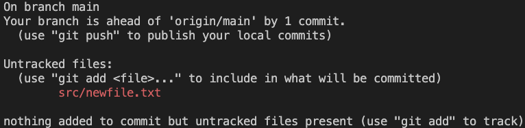
</div>

> Git has detected that a new file has been created but it is not being tracked, so it is not currently a physical part of the repository
> We need to add the file to the repository and then commit the changes to make it a permanent part of the repository

**Step 4.** Run the `git add` command followed by the filename to stage the new file for committing

```bash
git add src/newfile.txt
```

**Step 5.** Run the `git status` command to see that the new file has been staged for committing

<div style="border: 1px solid rgb(128, 128, 128); margin: 20px; text-align: center;">
    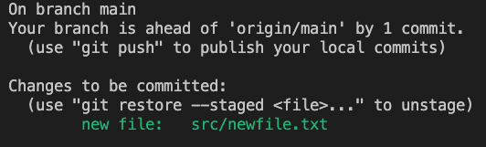
</div>

> If any content was added to this new file before adding it, that content would be part of the staged changes.

---

### Activity 3.3 - Making Changes to Multiple Files and Committing them

**Step 1.** Navigate to the repository directory on your command line, GitBash or terminal

**Step 2.** Add some more text to an existing file in the repository using the `echo` command, and the *append to end of file* operator `>>`

```bash
echo "Some more additional text in an existing file" >> src/existingfile.txt
```

**Step 3.** Add some text to the end of the new file that was created in the last step

```bash
echo "Some text in a new file" >> src/newfile.txt
```

**Step 4.** Run the `git status` command to see which files have been changed

<div style="border: 1px solid rgb(128, 128, 128); margin: 20px; text-align: center;">
    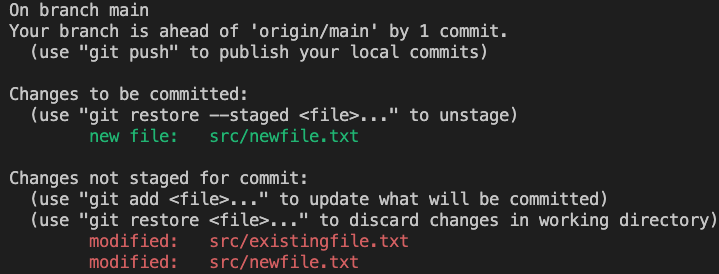
</div>

> ***Note:*** In this instance, src/newfile.txt has both changes to be committed (i.e. the addition of the file to the repo) and unstanged changes (i.e. the text added after it was initially staged)
>
> What would be the result of committing at this point in time?

<details>

In this instance, committing without any further adding would result in the empty `newfile.txt` being committed to the repository and the changes to both files remaining unstaged.

</details>

**Step 5.** Run the `git add` command followed by the filename to stage the changes for committing

```bash
git add .
```

> When adding multiple files, `.` can be used to stage all changes in all files the repository (so long as you are in the root directory of the repository)
> If you add from a subdirectory, you will only stage changes in that subdirectory and below

**Step 6.** Run the `git status` command to see that all changes have been staged for committing

<div style="border: 1px solid rgb(128, 128, 128); margin: 20px; text-align: center;">
    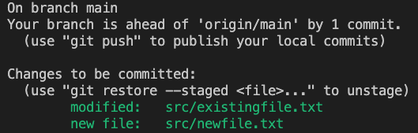
</div>

**Step 7.** Run the `git commit` command followed by the `-m` flag and a message in quotes to commit the changes

```bash
git commit -m "Update existingfile and newfile"
```

**Step 8.** Run the `git status` command to see that there are no further changes to commit

<div style="border: 1px solid rgb(128, 128, 128); margin: 20px; text-align: center;">
    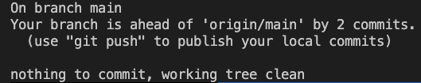
</div>

> So there are now 2 commits that are part of the local repository but not part of the remote repository on GitHub

---

### Activity 3.4 - Pushing to the Remote Repository on GitHub

**Step 1.** Open your forked repository from GitHub in your browser and select the Code option to see the list of files current in this remote repository

> You should notice that the changes to `exsitingfile.txt` are not present AND that `newfile.txt` is not present at all
>
> Take a note of the commit ID that the repository is currently showing.

<div style="border: 1px solid rgb(128, 128, 128); margin: 20px; text-align: center;">
    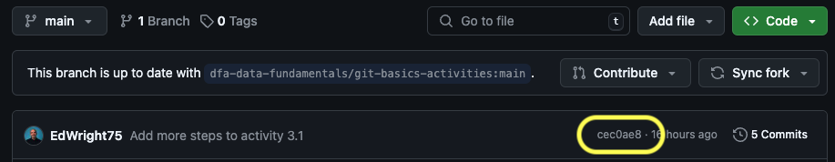
</div>

> **Note:** The commit ID here and the number of commits may differ in your repository

**Step 2.** To understand where your local repo is in relation to the remote repo, run the `git log --oneline` command to see the commit history

```bash
git log --oneline
```

<div style="border: 1px solid rgb(128, 128, 128); margin: 20px; text-align: center;">
    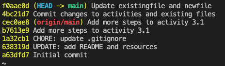
</div>

> **Note:** The commit IDs here and the number of commits may differ in your repository
>
> `origin/main` should be next to the commit ID that you noted down from the remote repository on GitHub
>
> There are 2 commits after this - that shouldn't be a surprise as we have made 2 commits locally that haven't been pushed to the remote repository yet!
> `HEAD -> main` should be next to the commit ID that is the most recent commit in your local repository

**Step 3.** Run the `git push` command followed by the `-u` flag and the name of the remote repository (usually `origin`) and the name of the branch you are pushing to (usually `main`)

```bash
git push -u origin main
```

> The `-u` flag is used to set the upstream branch for the local branch - this is only usually needed on the first occasion that you push to a remote repository
>
> To understand what the upstream branch is, you can run the `git remote -v` command

**Step 4.** Run the `git log --oneline` command to see the commit history again - this time you should see `Head -> main` and `origin/main` branch point to the same commit

<div style="border: 1px solid rgb(128, 128, 128); margin: 20px; text-align: center;">
    
</div>

**Step 5.** Refresh the repository page on GitHub in your browser and you should see the changes that you made locally now present in the remote repository

> i.e. the commit ID shown at the top of the git log should be the same as the commit ID show in the remote repository on GitHubZZ

---
---

## Activity 4: Going Back in Time

### Activity 4.1 - Checking the Commit History

**Step 1.** Viewing the commit history using the `git log` command

```bash
git log
```

> This will show you the commit history for the repository, starting with the most recent commit at the top and includes full details of the commit

<div style="border: 1px solid rgb(128, 128, 128); margin: 20px; text-align: center;">
    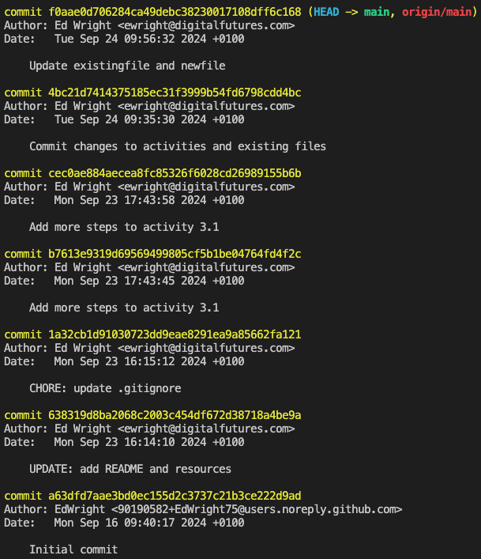
</div>

> Exit this screen by pressing `q` or `Shift` + `ZZ` (pressing `Z` twice while holding down the `Shift` key)

**Step 2.** View the commit history using the `--oneline` switch to see a more concise view of the commit history

```bash
git log --oneline
```

<div style="border: 1px solid rgb(128, 128, 128); margin: 20px; text-align: center;">
    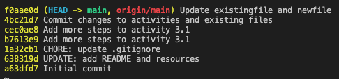
</div>

> Exit this screen by pressing `q` or `Shift` + `ZZ` (pressing `Z` twice while holding down the `Shift` key)

---

### Activity 4.2 - Viewing a Previous Commit

**Step 1.** Take a note of the commit ID of a previous commit from the `git log --oneline` command

**Step 2.** Run the `git checkout` command followed by the commit ID to view the repository at that point in time

```bash
# In this example, we have decided to see the repository at the commit ID of 1a32cb1
git checkout 1a32cb1
```

> You will have noticed that `--oneline` only shows the first 7 characters of the commit ID
>
> It most repositories, these first 7 characters are unique enough to identify a commit
>
> If you need to see the full commit ID, you can run the `git log` command to see the full commit ID and use `git checkout` with further characters (not necessarily the full ID) to identify the commit

The result of this command is gruesomely called `'detached HEAD state'` - this is because you are no longer at the most recent commit on the branch you are working on

<div style="border: 1px solid rgb(128, 128, 128); margin: 20px; text-align: center;">
    
</div>

At this point you have a number of options:

- Work with the code as it was at this point but any commits you make will not be part of the repository you were working on
- Create a new branch and continue a new line of development
- Return to the most recent commit on the branch you were working on

---

### Activity 4.3 - Returning to the Most Recent Commit

**Step 1.** Run the `git switch -` command

<div style="border: 1px solid rgb(128, 128, 128); margin: 20px; text-align: center;">
    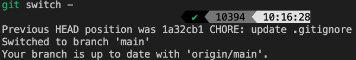
</div>

> Other options here to return to the most recent commit are:
>
> - `git checkout main` (or the branch name you are on)
> - `git switch main` (or the branch name you are on)
> - `git checkout commitID` (where `commitID` is the most recent commit ID)

---
---

## Additional Activities

### Activity 5: Branching and Merging

It is a mantra of developers that you should never "hack" on the `main` branch of a repository - this is because it is the branch that is most likely to be deployed to a live environment and should be kept as stable as possible.

Branching is a way to create a copy of the repository that you can make changes to without affecting the `main` branch.

Changes can then be merged (or pulled) back into the `main` branch when they have been reviewed and approved.  This is usually done using a ***Pull Request*** on GitHub and will be the response to an ***"Issue"*** (or requirement) from the ***Product Backlog***.

---

#### Activity 5.1 - Creating a New Branch locally

**Step 1.** Run the `git branch` command followed by the name of the new branch to create a new branch

```bash
git branch new-feature
```

> BEST PRACTICE: Branch names should be descriptive of the work that is going to be done on that branch, e.g. `feature/new-feature` or `bugfix/issue-123`

**Step 2.** View the branches in the repository using the `git branch` command

```bash
git branch
```

<div style="border: 1px solid rgb(128, 128, 128); margin: 20px; text-align: center;">
    
</div>

> You will notice that `main` is still the *active* branch, signified by the `*` next to the branch name
>
> Exit this screen by pressing `q` or `Shift` + `ZZ` (pressing `Z` twice while holding down the `Shift` key)

**Step 3.** Run the `git switch` command followed by the name of the new branch to switch to the new branch

```bash
git switch new-feature

# Result:
Switched to branch 'new-feature'
```

> BEST PRACTICE: The `switch` command is now preferred over the `checkout` command for changing branches as `checkout` has multiple uses and can be confusing
>
> As well as changing branches, as shown earlier, `checkout` can be used to view previous commits AND to restore files to their previous state

---

#### Activity 5.2 - Making Changes on the New Branch

**Step 1.** Make some changes to the repository on the new branch

```bash
echo "Some text on the new branch" >> src/newfile.txt
```

**Step 2.** Run the `git status` command to see which files have been changed

**Step 3.** Run the `git add` command followed by the filename to stage the changes for committing

> At this point, try to switch back to the main branch and see what happens
>
> You will be warned that you have uncommitted changes on the current branch and that you need to commit them, stash them or discard them before you can switch branches  
> This is because the changes you have made are not part of the main branch and will not be carried over when you switch branches
>
> - You can use the `git stash` command to save the changes for later and then use the `git stash pop` command to reapply them when you return to the branch  
> - You can use the `git restore --staged` command to unstage the changes and then use the `git restore` command to discard the changes
>
> You would then be able to switch to any branch without any issues

**Step 3.** Run the `git commit` command followed by the `-m` flag and a message in quotes to commit the changes

**Step 4.** Run the `git status` command to see that there are no further changes to commit

---

#### Activity 5.3 - Pushing the New Branch to GitHub

**Step 1.** Run the `git push` command followed by the `-u` flag and the name of the remote repository (usually `origin`) and the name of the branch you are pushing to (usually `main`)

```bash
git push -u origin new-feature
```

> You can access the name of the remote repository by running the `git remote` command
>
> You can get the URL of the remote repository by running the `git remote -v` command

<div style="border: 1px solid rgb(128, 128, 128); margin: 20px; text-align: center;">
    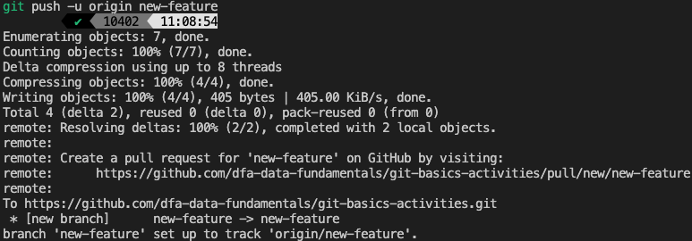
</div>

This is suggesting that to make the changes part of the `main` branch of the repository - and therefore part of the production release of the code, you need to create a ***Pull Request*** on GitHub.

> INDUSTRY PRACTICE: It is common for the `main` or `production` branch to be protected on the remote, so changes can only be made after a set of "rules" have been adhered to.  These can include (but not limited to):
>
> - A review of the changes by another developer
> - The passing of automated tests
> - The approval of a team lead or manager
> - The approval of the product owner or customer
> - The approval of the quality assurance team
> - The approval of the security team
>
> It is unlikely developers will have the permissions to merge their own changes into the `main` or `production` branch, or to commit directly to it.

**Step 2.** View your repository in GitHub in your browser, refreshing the page if necessary

You should see a message at the top of the page that suggests you can create a Pull Request to merge the new branch into the `main` branch

You can view the different branches in the repository by clicking on the `main` branch dropdown and selecting the `new-feature` branch

<div style="border: 1px solid rgb(128, 128, 128); margin: 20px; text-align: center;">
    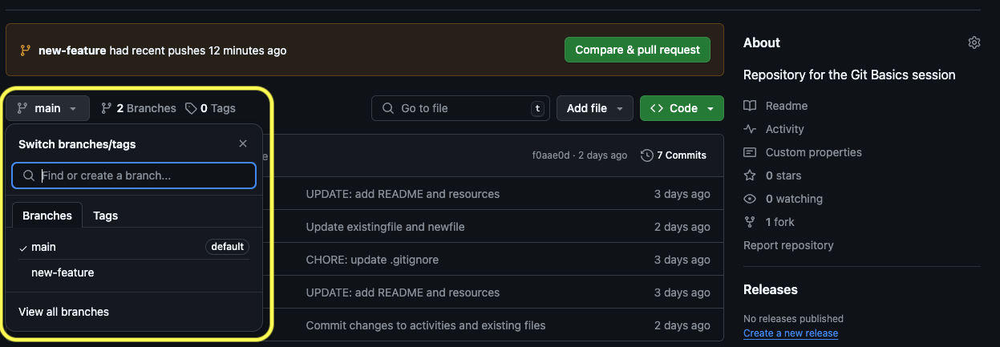
</div>

---

#### Activity 5.4 - Starting the Merge of the New Branch into `main` by Creating a Pull Request

**Step 1.** In GitHub, click the `Compare & pull request` button to create a new Pull Request

**Step 2.** Write a comment for the pull request

> Best practices for a pull request comment when merging into a production branch in the industry include:
>
> - **Provide Context:** Explain the purpose of the changes and any relevant background information.
> - **Summarize Changes:** Give a brief overview of what was changed, added, or removed.
> - **Highlight Key Changes:** Point out any significant changes or areas that require special attention during the review.
> - **Reference Issues or Tickets:** Link to any relevant issues, tickets, or user stories that the pull request addresses.
> - **Include Testing Information:** Describe how the changes were tested and any test results.
> - **Mention Dependencies:** Note any dependencies or related pull requests that need to be merged first.
> - **Request Specific Feedback:** If there are areas where you need specific feedback, mention them.
> - **Be Professional and Courteous:** Maintain a professional tone and be respectful to reviewers.

```md
### Purpose
This pull request implements the new user authentication feature as described in issue #123. The goal is to enhance security by adding login and registration functionality.

### Summary of Changes
- Added `login` and `register` endpoints to the API.
- Implemented password hashing using bcrypt.
- Updated the user model to include authentication fields.
- Added unit tests for the new authentication methods.
- Updated the documentation to include authentication details.

### Key Changes
- **User Model**: Added `password_hash` and `last_login` fields.
- **API Endpoints**: New endpoints for user login and registration.
- **Security**: Passwords are now hashed before storing in the database.

### Testing
- Unit tests have been added and all tests are passing.
- Manual testing was performed to verify the login and registration flows.

### Dependencies
- This pull request depends on the database migration in PR #456.

### Request for Feedback
- Please review the password hashing implementation for any potential security issues.
- Feedback on the API endpoint structure would be appreciated.

### References
- Issue: #123
- Related PR: #456

Thank you for reviewing this pull request!
```

<div style="border: 1px solid rgb(128, 128, 128); margin: 20px; text-align: center;">
    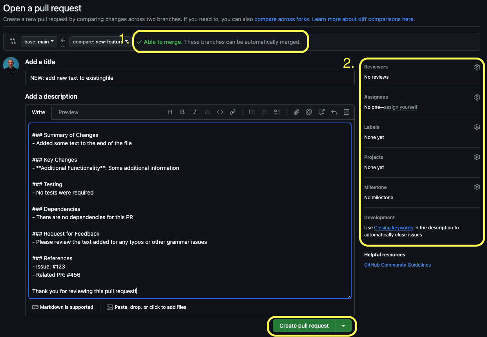
</div>

In this image:

1. This means that there are no conflicts between the branches and the changes can be merged automatically
   - Should conflicts exist, you would need to resolve them before the changes can be merged
   - Conflicts can occur when the same lines of code have been changed in different ways in the different branches
   - Conflicts can be resolved by editing the files in question to remove the conflict markers and then committing the changes
   - Conflicts are usually resolved locally and require a new commit to be pushed to the remote repository that contains the resolution
   - [GitHub's documentation on resolving conflicts](https://docs.github.com/en/pull-requests/collaborating-with-pull-requests/addressing-merge-conflicts)
2. This section is for you to be able to assign meta information to the pull request - usually you will be allocated:
   - a code-reviewer - you would assign them using their GitHub handle which will appear in a dropdown
   - assingees - you can assign the pull request to someone to review and merge
   - labels - you can add labels to the pull request to categorise it - like `bug`, `feature`, `enhancement`, `documentation`, etc.
   - projects - you can add the pull request to a project board
   - milestones - you can add the pull request to a milestone
     - These are both GitHub features often used to help track a progress

**Step 3.** Review the changes - these are listed and shown at the bottom of the page:

<div style="border: 1px solid rgb(128, 128, 128); margin: 20px; text-align: center;">
    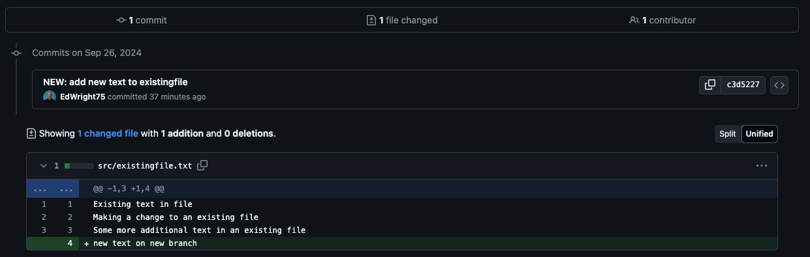
</div>

- These show the changes that will be made to the files in the `main` branch if the pull request is merged
- Conflicts would be shown here if they existed

**Step 4.** Click the `Create pull request` button to create the pull request

---

#### Activity 5.5 - Reviewing the Pull Request and Completing the Merge into `main`

> In industry, you are unlikely to be able to review and merge your own pull requests, so we will look at the process here from the perspective of the reviewer

**Step 1.** Open the pull request in GitHub in your browser (often you'll be notified by email or a message in Slack or other service that a pull request has been created and you are assigned to review it)

**Step 2.** Review the changes made in the pull request

**Step 3.** Add comments to the pull request if you have any feedback or questions

**Step 4.** Approve the pull request if you are happy with the changes

> Rejecting the Pull Request will send it back to the author for further work

**Step 5.** Merge the pull request into the `main` branch

<div style="border: 1px solid rgb(128, 128, 128); margin: 20px; text-align: center;">
    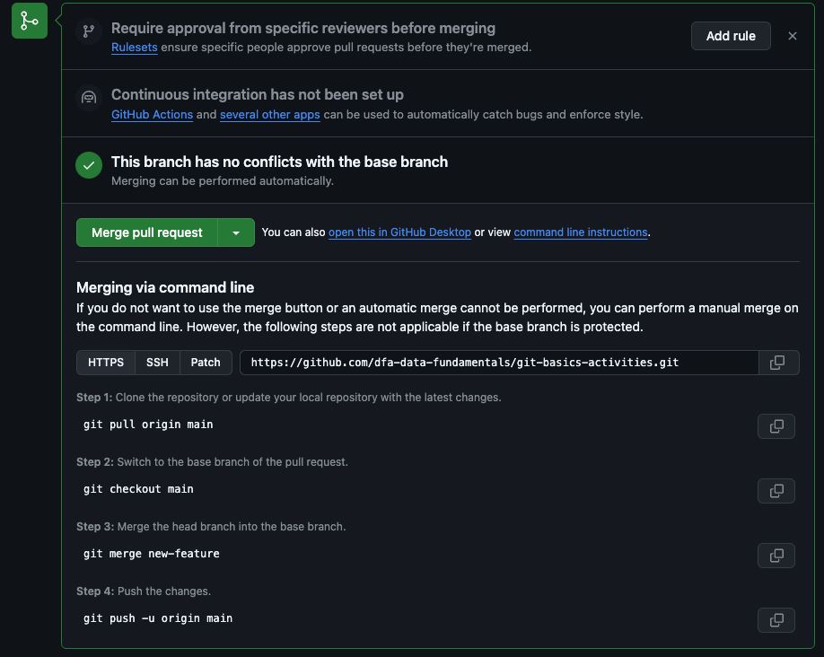
</div>

> This image also shows the command line instructions for merging the pull request locally
>
> This is often preferred as it is easier to resolve conflicts locally than on GitHub and may well be part of a review meeting with the author and the conflicting author

**Step 6.** Confirm the merge - this also closes the pull request

<div style="border: 1px solid rgb(128, 128, 128); margin: 20px; text-align: center;">
    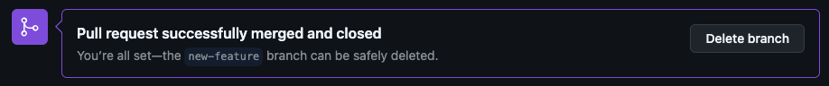
</div>

#### Activity 5.5 - Deleting the New Branch both locally and on GitHub

**Step 1.** Click the `Delete branch` button to delete the branch on GitHub - you will no longer be able to see the `new-feature` branch in the dropdown

> However, the branch still exists locally on your computer, so we should remove this too

**Step 2.** Make sure you are on the `main` branch locally

```bash
git switch main
```

**Step 3.** Run the `git branch -d` command followed by the name of the branch to delete the branch locally

```bash
git branch -d new-feature
```

**Step 4.** Run the `git branch` command to see that the branch has been deleted

```bash
git branch
```

**Step 5.** Run the `git pull` command to update your `main` branch with the changes that were merged in the pull request

```bash
git pull
```

<div style="border: 1px solid rgb(128, 128, 128); margin: 20px; text-align: center;">
    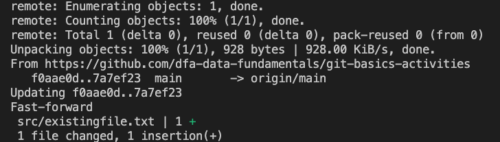
</div>

> This will update your local repository with the changes that were merged into the `main` branch on GitHub
>
> This is important as you will want to continue working on the most up-to-date version of the code
