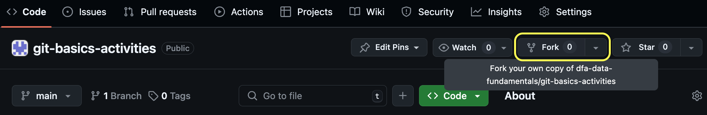
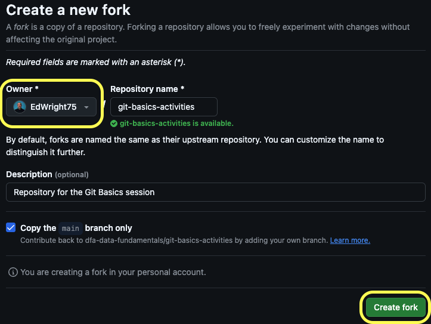
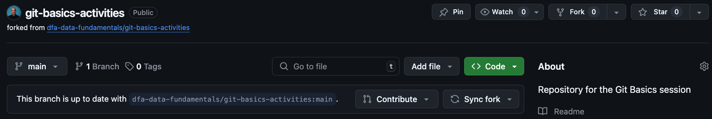
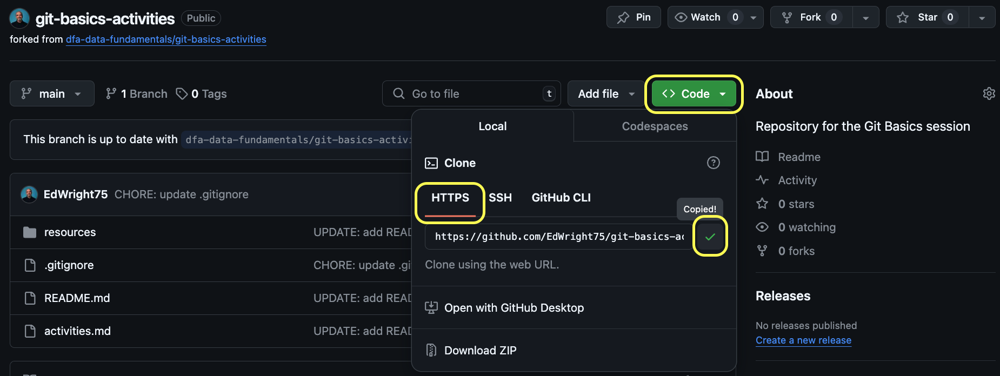
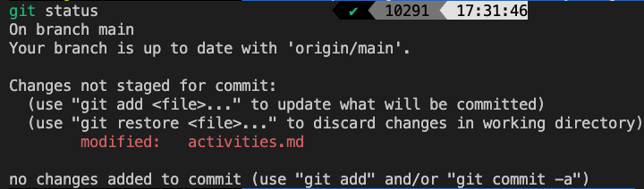
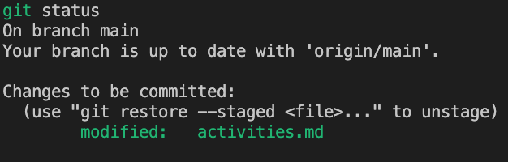

# Git Basics (Short Version) Activities

This repository contains the reference materials for engineers who need to learn and practice the basics of version control using Git and GitHub.

The preferences are that you will use GitBash (on Windows) or Terminal (on MacOS/Linux) to complete these activities.

---

## Pre-requisites

### 1. You have downloaded and install Git on your computer

> For Windows users, you can download Git from the [Git for Windows website](https://gitforwindows.org/)
> For MacOS users, you can install Git using Homebrew with the command `brew install git`
> For Linux users, you can install Git using your package manager with the command `sudo apt-get install git`

### 2. You have signed up for a GitHub account

> If you haven't got a GitHub account, go to [https://github.com] and sign up for a free account
> You will be able to enrol your account into the GitHub Education program to get access to free resources

### 3. You have configured Git with your GitHub account

> You will need to configure Git with your GitHub account so that you can push and pull changes to and from GitHub
> You can do this by running the following commands in your terminal or GitBash:

```bash
git config --global user.name "Your Name"
git config --global user.email "your@github-account.email"
git config --global init.defaultBranch main
```

> The `init.defaultBranch` command is optional, but it is recommended to set this to `main` to match the default branch name on GitHub and is a more inclusive term than the current default of `master` which is currently being phased out

---

## Contents

- [Git Basics (Short Version) Activities](#git-basics-short-version-activities)
  - [Pre-requisites](#pre-requisites)
    - [1. You have downloaded and install Git on your computer](#1-you-have-downloaded-and-install-git-on-your-computer)
    - [2. You have signed up for a GitHub account](#2-you-have-signed-up-for-a-github-account)
    - [3. You have configured Git with your GitHub account](#3-you-have-configured-git-with-your-github-account)
  - [Contents](#contents)
  - [Activity 1: Fork an existing GitHub Repository](#activity-1-fork-an-existing-github-repository)
  - [Activity 2: Cloning a Repository](#activity-2-cloning-a-repository)
  - [Activity 3: Making and Managing Changes](#activity-3-making-and-managing-changes)
    - [Activity 3.1 - Changing an Existing File and Committing them](#activity-31---changing-an-existing-file-and-committing-them)
    - [Activity 3.2 - Adding a New File and Tracking it](#activity-32---adding-a-new-file-and-tracking-it)
    - [Activity 3.3 - Making Changes to Multiple Files and Committing them](#activity-33---making-changes-to-multiple-files-and-committing-them)
    - [Activity 3.4 - Pushing to the Remote Repository on GitHub](#activity-34---pushing-to-the-remote-repository-on-github)
  - [Activity 4: Going Back in Time](#activity-4-going-back-in-time)
    - [Activity 4.1 - Checking the Commit History](#activity-41---checking-the-commit-history)
    - [Activity 4.2 - Reverting to a Previous Commit](#activity-42---reverting-to-a-previous-commit)
    - [Activity 4.3 - Pushing the Reverted Changes to GitHub](#activity-43---pushing-the-reverted-changes-to-github)
  - [Additional Activities](#additional-activities)
  - [Activity 5: Branching and Merging](#activity-5-branching-and-merging)
    - [Activity 5.1 - Creating a New Branch locally](#activity-51---creating-a-new-branch-locally)
    - [Activity 5.2 - Making Changes on the New Branch](#activity-52---making-changes-on-the-new-branch)
    - [Activity 5.3 - Pushing the New Branch to GitHub](#activity-53---pushing-the-new-branch-to-github)
    - [Activity 5.4 - Merging the New Branch into `main`](#activity-54---merging-the-new-branch-into-main)
    - [Activity 5.5 - Deleting the New Branch both locally and on GitHub](#activity-55---deleting-the-new-branch-both-locally-and-on-github)
    - [Activity 5.6 - Creating a Pull Request to Merge the New Branch into `main`](#activity-56---creating-a-pull-request-to-merge-the-new-branch-into-main)

---

## Activity 1: Fork an existing GitHub Repository

Forking a repository is a way to create a copy of an existing repository on GitHub that you can make changes to without affecting the original repository.

**Step 1.** Open this repository from GitHub in your browser: [https://github.com/dfa-data-fundamentals/git-basics-activities]

**Step 2.** Click the "Fork" button in the top right corner of the page



**Step 3.** Select your account as the destination for the fork and then click the "Create fork" button



**Step 4.** Wait for the fork to be created and then you will be taken to your forked repository



> You are now able to make changes to this repository without affecting the original repository
>
> This is useful if you are using a repo as a starting point for your own project
>
> You can create a pull request to suggest changes to the original repository that the owner can approve or reject
>
> You can keep your for up-to-date with the original repository by syncing the changes from the original repository to your fork

---

## Activity 2: Cloning a Repository

Cloning a repository is a way to create a copy of an existing repository on GitHub on your local computer that you can make changes to and push back to GitHub.

> **Note:** This can be done for ANY repository you have access to, not just forked repos

**Step 1.** Open your forked repository from GitHub in your browser and location the green Code button

**Step 2.** Make sure that the HTTPS option is selected and then click the clipboard icon to copy the URL to your clipboard



**Step 3.** Open GitBash or Terminal on your computer and navigate to the directory where you want to clone the repository

```bash
cd /path/to/your/directory
```

**Step 4.** Run the `git clone` command followed by the URL you copied from GitHub

```bash
git clone https://github.com/YOUR_GITHUB_USERNAME/git-basics-activities.git
```

> The ***HTTPS*** method is not the only way you can clone a repository.
>
> The ***SSH*** method is often used in industry as it is more secure and doesn't require you to enter your GitHub username and password every time you push or pull changes.  It uses a public/private key pair to authenticate you with GitHub.
>
> You can find instructions on how to set up SSH keys on GitHub [here](https://docs.github.com/en/github/authenticating-to-github/connecting-to-github-with-ssh)
>
> You can then clone a repository using the SSH URL instead of the HTTPS URL
>
> The ***GitHub CLI*** method can be used if you have installed the GitHub CLI on your computer.  You can find instructions on how to install the GitHub CLI [here](https://cli.github.com/manual)
>
> GitHub CLI allows you to clone a repository using the `gh repo clone` command followed by the repository name
>
> The ***GitHub Desktop*** method can be used if you have installed the GitHub Desktop application on your computer.  You can find instructions on how to install GitHub Desktop [here](https://desktop.github.com/)
>
> GitHub Desktop allows you to clone a repository using the "Clone a Repository" option in the File menu
>
> Finally, you can download a ZIP file that contains the repository contents by clicking the "Download ZIP" button on the repository page on GitHub, however, you will not be able to make changes to the repository on GitHub or make a pull request to the original repository if you do this

---

## Activity 3: Making and Managing Changes

### Activity 3.1 - Changing an Existing File and Committing them

**Step 1.** Open the repository in your code editor and MAKE SOME CHANGE TO FILE ZZZZXXXX.MD AND SAVE THE FILE

**Step 2.** Save the changes and then open ***GitBash*** or ***Terminal*** in the repository directory (use the `cd` command to navigate to the directory)

**Step 3.** Run the `git status` command to see which files have been changed

```bash
git status
```



**Step 4.** Run the `git add` command followed by the filename to stage the changes for committing

```bash
# In this example, the file was called activities.md
git add activities.md
```

**Step 5.** See the result of the `add` command by running `git status` again



**Step 6.** Restore the file to its original state by running the `git restore --staged` command, followed by the filename

```bash
git restore --staged activities.md
```

**Step 7.** See the result of the `restore` command by running `git status` again

> You should see that the changes have been unstaged and the file is back to its original state

**Step 8.** Repeat steps 1-5 to stage the changes again

**Step 9.** Run the `git commit` command followed by the `-m` flag and a message in quotes to commit the changes

```bash
git commit -m "Updated the activities file"
```

> If you omit the `-m` flag, Git will open a text editor for you to enter a commit message
> You can use the `i` key to enter insert mode and type your message
> You can then press `ESC` to exit insert mode and type `:wq` to save and exit the text editor
> If you make a mistake, you can press `ESC` and type `:q!` to exit without saving
> You can also use the `git commit -am` command to stage and commit all changes in one step

**Step 10.** Run the `git status` command to see that there are no further changes to commit

### Activity 3.2 - Adding a New File and Tracking it

### Activity 3.3 - Making Changes to Multiple Files and Committing them

### Activity 3.4 - Pushing to the Remote Repository on GitHub

---

## Activity 4: Going Back in Time

### Activity 4.1 - Checking the Commit History

### Activity 4.2 - Reverting to a Previous Commit

### Activity 4.3 - Pushing the Reverted Changes to GitHub

---

## Additional Activities

## Activity 5: Branching and Merging

### Activity 5.1 - Creating a New Branch locally

### Activity 5.2 - Making Changes on the New Branch

### Activity 5.3 - Pushing the New Branch to GitHub

### Activity 5.4 - Merging the New Branch into `main`

### Activity 5.5 - Deleting the New Branch both locally and on GitHub

### Activity 5.6 - Creating a Pull Request to Merge the New Branch into `main`
